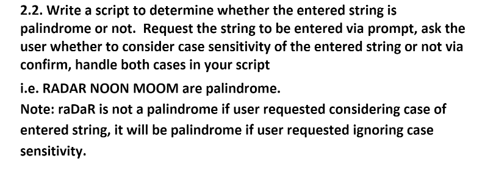

### Palindrome

Another task for ITI on day 1 of the JS course to tell if the string is palindrome or not as shown in the [demonstration](https://youtu.be/mMINwmQkzgk).

## Requirements

Try the [palindrome](https://aya-hegab.github.io/palindrome-js-day1_task2-iti/) now.
